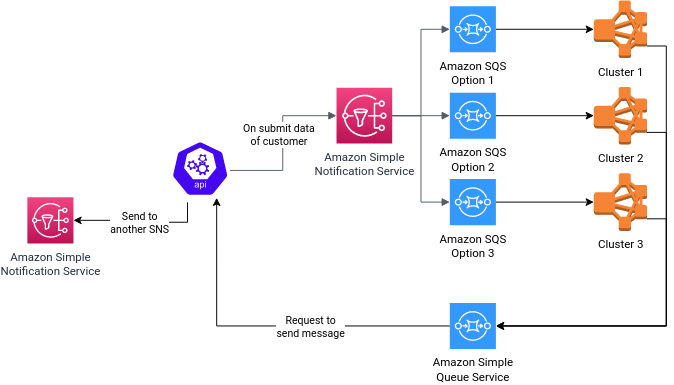

# Simple Notifier API  
## Description
Using AWS SNS and SQS technologies to send and receive messages.

### How it's work
<p align="center" width="100%">
  
</p>
  
## How to run
### Requirements
- Docker 
- Docker-compose
- AWS CLI

### Executing

- Compile project
```bash
   $ ./gradlew assemble
```

- Run docker-compose
```bash
   $ docker-compose up --build
```

- Change file permission
```bash
   $ chmod 0755 ./support/configure-aws-services.sh
   $ chmod 0755 ./support/send-notification.sh
   $ chmod 0755 ./support/send-notification-invalid.sh
```

- Run support script
```bash
   $ ./support/configure-aws-services.sh
```